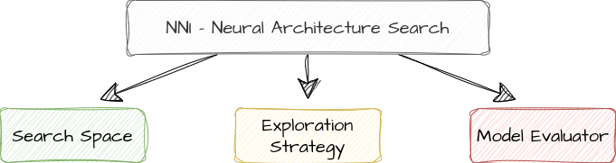

## Neural Architecture Search

Directory for Neural Architecture Search using the [Neural Network Intelligence](https://nni.readthedocs.io/en/stable/index.html) (NNI) framework. 

### NAS

Generally speaking, NNI implements neural architecture search by using a model space, search strategy and a model evaluator:



#### Model Space

#### Exploration Strategy

#### Model Evaluator

#### Configuration
The configuration for the search can be found in ```DeepCrazyhouse/configs/nas_config.py```.
